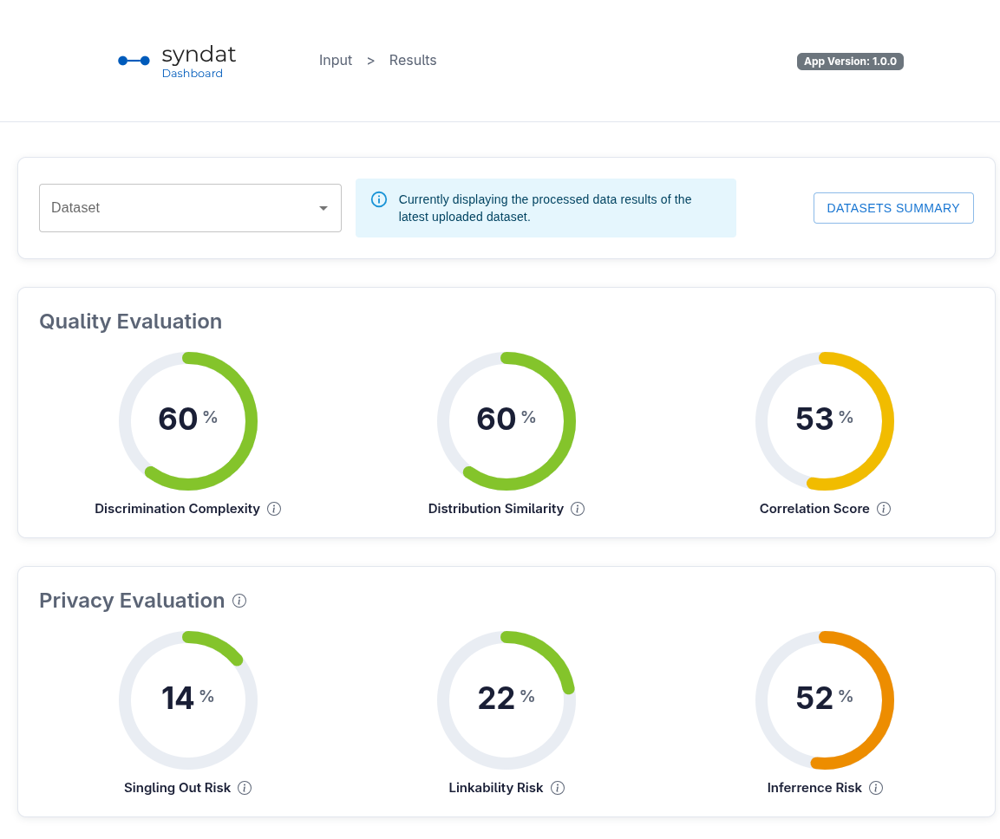
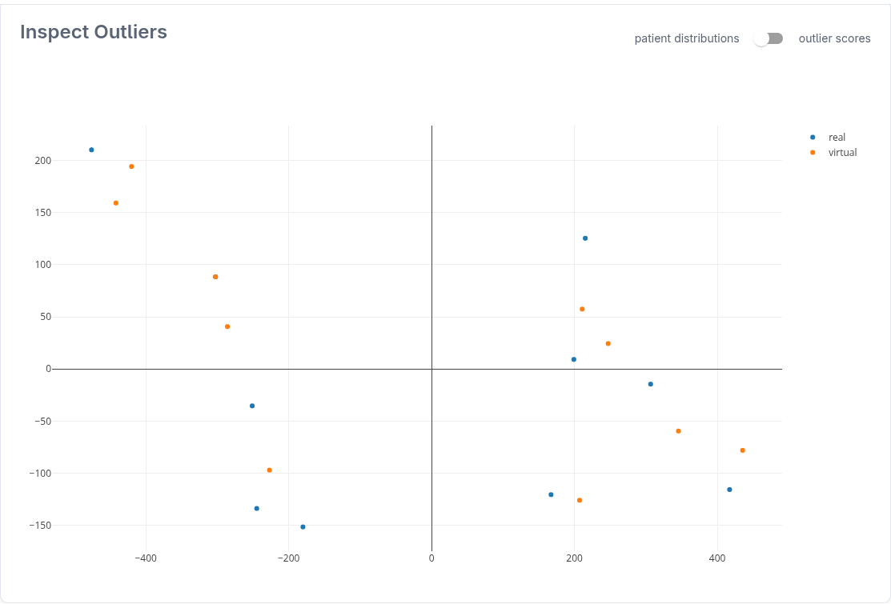

<p align="left">
	<picture>
		<source media="(prefers-color-scheme: dark)" srcset="frontend/public/brand/syndat_dashboard_white.svg">
		
	</picture>
</p>

<p align="left"><a href="https://doi.org/10.5281/zenodo.15399485"></a>&nbsp;<a href="https://github.com/nfdi4health/syndat-dashboard/actions/workflows/system-smoke.yml"></a>&nbsp;<a href="https://github.com/nfdi4health/syndat-dashboard/releases"></a>&nbsp;<a href="https://github.com/nfdi4health/syndat-dashboard/blob/main/LICENSE.md"></a></p>

SYNDAT compares synthetic patient-level data with the original tabular data.
The dashboard brings together quality metrics, privacy risk estimates, and plots
for examining where the datasets agree and where they differ.

Developed as part of TA6.4 of the [NFDI4Health Initiative](https://www.nfdi4health.de/).

## The dashboard

The Results page shows distribution and correlation similarity alongside
discrimination complexity and estimates of singling out, linkability, and
inference risk.



A two-dimensional embedding places original and synthetic records in the same
plot. The controls switch between patient distributions and outlier scores.
Feature-level violin and bar plots, together with correlation plots, provide
more detailed comparisons.



## Using SYNDAT

1. Upload the original and synthetic datasets as CSV files with matching column names on the **Input** page.
2. Start evaluation to compute the metrics and plots.
3. Open **Results** to inspect the scores, distributions, outliers, and correlations.
4. Save results under a dataset name to revisit them or compare scores in **Datasets Summary**.

Processing a new upload replaces the current results. Save any results you want
to keep before starting another evaluation. The backend also exposes an API for
programmatic access.

## Running locally

### Docker

From the repository root, build the frontend assets before starting the
containers. The frontend Docker image serves the existing build; it does not
build the application itself.

```bash
cd frontend
npm ci --legacy-peer-deps
REACT_APP_API_BASE_URL=http://localhost:8000 npm run build
cd ..
docker compose up --build
```

This requires Node.js and Docker with Compose. Node.js 24 is used in CI.
Open the dashboard at [localhost:3000](http://localhost:3000) and the API
documentation at [localhost:8000/docs](http://localhost:8000/docs).

### Local development

CI uses [Node.js 24](https://nodejs.org/) and
[Python 3.12](https://www.python.org/downloads/).

From the repository root, create a Python environment and start the backend:

```bash
python3.12 -m venv .venv
source .venv/bin/activate
pip install --requirement backend/requirements.txt
cd backend
uvicorn api.routes:app --reload
```

In a second terminal, also from the repository root:

```bash
cd frontend
npm ci --legacy-peer-deps
REACT_APP_API_BASE_URL=http://localhost:8000 npm run dev
```

Open [localhost:3000](http://localhost:3000). The API URL can also be set in
[`frontend/.env`](frontend/.env); it is read when Vite starts or builds the frontend.

### Python package

For evaluation and visualization directly in Python, use the separate
[`syndat` package](https://github.com/SCAI-BIO/syndat):

```bash
pip install syndat
```

## API authentication

The `/datasets/import` and `/datasets/export` endpoints use HTTP Basic
Authentication. Change the development credentials before exposing the API
outside your local machine.

For local development, set these variables before starting the backend;
otherwise it reads the defaults from [`backend/.env`](backend/.env):

```bash
export SYNDAT_ADMIN_USERNAME=your_username
export SYNDAT_ADMIN_PASSWORD=your_password
```

For Docker, change the backend service's environment settings in
[`docker-compose.yml`](docker-compose.yml). The Compose file sets the container
credentials explicitly; exporting variables in your shell does not override them.

## Citation

If you use **Syndat** in your research, please cite:

```bibtex
@article{Adams_On_the_fidelity_2025,
  author  = {Adams, Tim and Birkenbihl, Colin and Otte, Karen and
             Ng, Hwei Geok and Rieling, Jonas Adrian and
             Näher, Anatol-Fiete and Sax, Ulrich and Prasser, Fabian and Fröhlich, Holger},
  title   = {On the fidelity versus privacy and utility trade-off of synthetic patient data},
  journal = {iScience},
  volume  = {28},
  year    = {2025},
  doi     = {10.1016/j.isci.2025.112382}
}
```

## Support and license

For questions or support, contact the NFDI4Health helpdesk at
[helpdesk@nfdi4health.de](mailto:helpdesk@nfdi4health.de).
For bugs and feature requests, use the
[issue tracker](https://github.com/nfdi4health/syndat-dashboard/issues).

The repository is licensed under
[CC BY-NC-ND 4.0](LICENSE.md).
